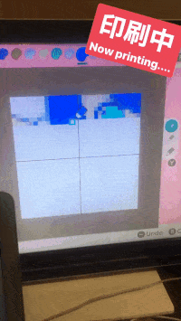

# ACHN-Autodraw


Connect microcontroller to the nintendo switch and draw picture in ACHN!

## Requirement
- ATMega32U4 Board or see [shinyquagsire23/Switch-Fightstick's README](https://github.com/shinyquagsire23/Switch-Fightstick/blob/master/README.md)
- USB to serial adapter
- USB micro-b cable * 2

- Flask (python 3.6+)

## Setup
[NintendoSwitchをPCから操作する - おいら屋ファクトリー](https://blog.feelmy.net/control-nintendo-switch-from-computer/)(in Japanese)

Recommend to read through to get a basic understanding

## Usage

### Game side
1. Open the custom design and leave it there (after click `edit design`)

### Program side

1. Run the web server

```
cd <project-root-folder>/web
./start_server
```

2. Access the web through the port as flask shows in the terminal
3. Prepared 32 x 32 image (by yourself) and click upload
4. Click generate color to recommend the color palette
5. Change the color in the palette by clicking on the box you want to change and click any position in the image to get the color of a pixel
6. Run (make sure everything is connected!)

